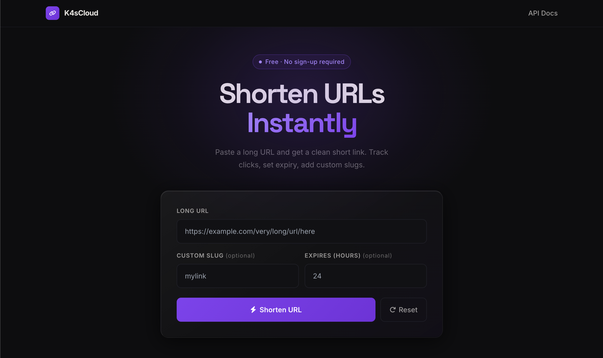
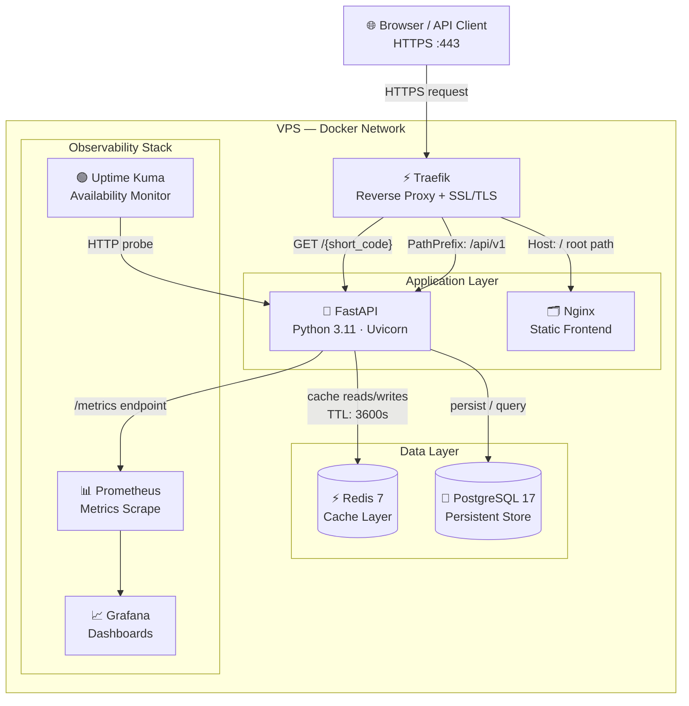
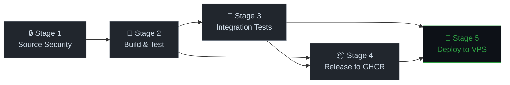

<p align="center">
  
</p>

<h1 align="center">K4sCloud URL Shortener</h1>

<p align="center">
  Production-grade URL shortening service with end-to-end observability,<br/>
  automated security scanning, and zero-downtime CI/CD.
</p>

<p align="center">
  <strong>Live Demo:</strong> <a href="https://short.k4scloud.com">short.k4scloud.com</a>
  &nbsp;|&nbsp;
  <a href="https://short.k4scloud.com/api/v1/docs">API Docs</a>
  &nbsp;|&nbsp;
  <a href="https://short.k4scloud.com/api/v1/health">Health Status</a>
</p>

<p align="center">


</p>

---

## Tech Stack

**Backend**


**Infrastructure**


**Observability**


**CI/CD & Security**


---

## Features

<table>
<tr>
<td align="center" width="33%">

**Core API**
- URL shortening + custom slugs
- Click tracking & analytics
- URL expiration (TTL)
- OpenAPI / Swagger UI

</td>
<td align="center" width="33%">

**Operational**
- Sub-5ms cache-hit responses
- 50–80% cache hit ratio
- Zero-downtime deployments
- Auto-rollback on failure

</td>
<td align="center" width="33%">

**Observability**
- 7 custom Prometheus metrics
- Grafana dashboards
- Uptime Kuma monitoring
- Structured health checks

</td>
</tr>
</table>

---

## Key Metrics

<table>
<tr>
<td align="center"><strong>&lt;5ms</strong><br/>Cache Hit Latency</td>
<td align="center"><strong>&lt;50ms</strong><br/>Cache Miss Latency</td>
<td align="center"><strong>99.9%+</strong><br/>Uptime</td>
<td align="center"><strong>85%+</strong><br/>Test Coverage</td>
<td align="center"><strong>193MB</strong><br/>Container Image</td>
<td align="center"><strong>10–15 min</strong><br/>Commit → Production</td>
</tr>
</table>

---

## Architecture

<p align="center">
  
</p>



### Request Flow

| Request Type | Path | Cache | Latency |
|---|---|---|---|
| Redirect | `GET /{short_code}` | Redis → PostgreSQL | <5ms (hit) / <50ms (miss) |
| Shorten | `POST /api/v1/shorten` | Write-through | <50ms |
| Stats | `GET /api/v1/stats/{code}` | PostgreSQL read | <50ms |
| Health | `GET /api/v1/health` | — | <10ms |

---

## CI/CD Pipeline

> Fully automated 5-stage pipeline — from commit to production in 10–15 minutes with automatic rollback on failure.



<table>
<thead>
<tr>
<th>Stage</th>
<th>Job</th>
<th>Tools</th>
<th>Quality Gate</th>
</tr>
</thead>
<tbody>
<tr>
<td><strong>1</strong></td>
<td>Source Security</td>
<td>
  
  
  
  
  
</td>
<td>Secret scan · SAST · Lint · Dependency CVEs</td>
</tr>
<tr>
<td><strong>2</strong></td>
<td>Build &amp; Test</td>
<td>
  
  
  
  
</td>
<td>Unit tests · 85%+ coverage · Container CVE scan · SBOM</td>
</tr>
<tr>
<td><strong>3</strong></td>
<td>Integration Tests</td>
<td>
  
  
  
</td>
<td>13 API tests · Real services (no mocks)</td>
</tr>
<tr>
<td><strong>4</strong></td>
<td>Release</td>
<td>
  
  
</td>
<td>Multi-tag push · latest · SHA · semver</td>
</tr>
<tr>
<td><strong>5</strong></td>
<td>Deploy to Production</td>
<td>
  
</td>
<td>Health check · Auto-rollback on failure</td>
</tr>
</tbody>
</table>

---

## API Documentation

<details>
<summary><strong>View API Reference</strong></summary>

### Base URL
```
https://short.k4scloud.com/api/v1
```

### Endpoints

**Create Short URL**
```http
POST /api/v1/shorten
Content-Type: application/json

{
  "original_url": "https://example.com",
  "custom_slug": "optional-custom-slug",
  "expires_in_hours": 24
}

Response: 200 OK
{
  "short_code": "abc123",
  "short_url": "https://short.k4scloud.com/abc123",
  "original_url": "https://example.com/",
  "clicks": 0,
  "created_at": "2026-03-05T12:00:00Z",
  "is_active": true
}
```

**Get URL Statistics**
```http
GET /api/v1/stats/{short_code}

Response: 200 OK
{
  "short_code": "abc123",
  "original_url": "https://example.com/",
  "total_clicks": 42,
  "is_active": true,
  "created_at": "2026-03-05T12:00:00Z"
}
```

**Redirect**
```http
GET /{short_code}

Response: 307 Temporary Redirect
Location: https://example.com/
```

**Health Check**
```http
GET /api/v1/health

Response: 200 OK
{
  "status": "healthy",
  "dependencies": {
    "database": "healthy",
    "cache": "healthy"
  }
}
```

**Cache Statistics**
```http
GET /api/v1/cache/stats

Response: 200 OK
{
  "total_keys": 150,
  "hits": 1200,
  "misses": 300
}
```

**Interactive Documentation**
- Swagger UI: `https://short.k4scloud.com/api/v1/docs`
- ReDoc: `https://short.k4scloud.com/api/v1/redoc`

</details>

---

## Deployment

### Production Deployment

Production deployment is fully automated via GitHub Actions:

1. Push code to `main` branch
2. CI/CD pipeline runs automatically (5 stages)
3. On success: images pushed to GHCR, SSH deploy to VPS
4. Post-deploy health checks — automatic rollback on failure

### Prerequisites
- Docker & Docker Compose
- PostgreSQL 17
- Redis 7
- Traefik reverse proxy (external network)

<details>
<summary><strong>Local Development Setup</strong></summary>

### Environment Variables
```bash
POSTGRES_HOST=postgres
POSTGRES_PORT=5432
POSTGRES_USER=postgres
POSTGRES_PASSWORD=<secure_password>
POSTGRES_DB=urlshortener

REDIS_HOST=redis
REDIS_PORT=6379
REDIS_PASSWORD=<secure_password>

CACHE_TTL=3600
BASE_URL=https://short.k4scloud.com
```

### Start Services
```bash
# Clone repository
git clone https://github.com/alchemistkay/url-shortener.git
cd url-shortener

# Create environment file
cp .env.example .env
# Edit .env with your credentials

# Start services
docker-compose up -d

# Verify deployment
curl http://localhost:8000/api/v1/health
```

</details>

---

## Monitoring & Observability

### Custom Prometheus Metrics

| Metric | Type | Description |
|---|---|---|
| `urlshortener_urls_created_total` | Counter | Total URLs shortened (labelled by `is_custom`) |
| `urlshortener_redirects_total` | Counter | Total redirects (labelled by `short_code`) |
| `urlshortener_cache_operations_total` | Counter | Cache ops (labelled by `operation`, `result`) |
| `urlshortener_active_urls` | Gauge | Current active URL count |
| `urlshortener_database_connections` | Gauge | Active DB connections |
| `urlshortener_redirect_duration_seconds` | Histogram | Redirect latency (buckets: 1ms–1s) |
| `urlshortener_app` | Info | App version and environment |

### Dashboards

Access from your Grafana instance:
- **URL Shortener Application Metrics** — request rate, latency p95/p99, error rate, cache hit ratio
- **Docker & Host Monitoring** — container health, resource utilization
- **Traefik Traffic Analysis** — routing, SSL, upstream health

---

## Performance Optimization

### Caching Strategy
- Cache-aside pattern with Redis
- TTL: 3600 seconds (configurable via `CACHE_TTL`)
- Cache hit: <5ms · Cache miss: <50ms
- Hit ratio: 50–80% in steady state

### Database
- Indexed `short_code` column for O(1) lookups
- SQLAlchemy connection pooling
- Prepared statements via ORM

### Container
- Multi-stage Docker build — 193MB final image (40% reduction)
- Nginx Alpine for static file serving with 30-day asset caching + GZIP

---

## Security

### Application Security
- HTTPS-only via Traefik with automatic Let's Encrypt renewal
- Input validation with Pydantic (`HttpUrl`, custom slug regex)
- SQL injection prevention via SQLAlchemy ORM
- Security headers on all responses

### Supply Chain & Container Security
- TruffleHog secret scanning on every push
- CodeQL SAST for Python and JavaScript
- pip-audit + safety for dependency CVEs
- Trivy container vulnerability scanning (CRITICAL/HIGH gates)
- Anchore SBOM generation per release
- Non-root container users

### Network Security
- Firewalled VPS — single ingress via Traefik
- Docker network isolation (separate networks for DB, cache, proxy)
- SSH key-based deployment (no password auth)
- Secrets delivered via SCP at deploy time (not env var expansion)

---

## Project Structure

```
url-shortener/
├── backend/
│   ├── main.py              # FastAPI application + all endpoints
│   ├── database.py          # PostgreSQL connection & session factory
│   ├── models.py            # SQLAlchemy ORM models (URL, Click)
│   ├── schemas.py           # Pydantic validation schemas
│   ├── cache.py             # Redis cache-aside implementation
│   ├── helpers.py           # Code generation & URL validation
│   ├── requirements.txt     # Pinned Python dependencies
│   ├── Dockerfile           # Multi-stage optimized build
│   └── tests/
│       ├── test_basic.py    # Unit tests
│       └── integration/
│           └── test_api.py  # 13 integration tests (real DB + Redis)
│
├── frontend/
│   ├── index.html           # Main UI (dark theme, glassmorphism)
│   ├── style.css            # Custom styling
│   ├── app.js               # Form handling, API calls, localStorage
│   ├── nginx.conf           # Static file serving + GZIP config
│   └── Dockerfile           # Nginx Alpine image
│
├── .github/
│   └── workflows/
│       └── ci.yml           # 5-stage CI/CD pipeline
│
├── docs/img/
│   └── banner-img.png       # README banner
│
├── docker-compose.yml       # Local development orchestration
└── README.md
```

---

## Future Roadmap

### Planned Features
- User authentication and personal dashboards
- Custom domains support
- Advanced analytics dashboard
- API rate limiting
- Link preview generation

### Infrastructure
- Kubernetes migration
- Multi-region deployment
- Database read replicas
- Advanced cache warming strategies

---

## Contributing

This is a portfolio project demonstrating production-grade DevOps practices. The codebase serves as a reference implementation for:
- Modern Python async web services (FastAPI)
- Docker containerization and multi-stage builds
- 5-stage CI/CD with automated security scanning
- Observability with Prometheus and Grafana
- Production deployment with Traefik and Docker

See [CONTRIBUTING.md](CONTRIBUTING.md) for guidelines.

---

## Author

**Kay Alchemist**

[](https://github.com/alchemistkay)
[](https://www.linkedin.com/in/kwaku-danso-366196120)

---

## License

MIT License — see [LICENSE](LICENSE) for details.

---

<p align="center">
  <sub>Last updated: March 2026</sub>
</p>
